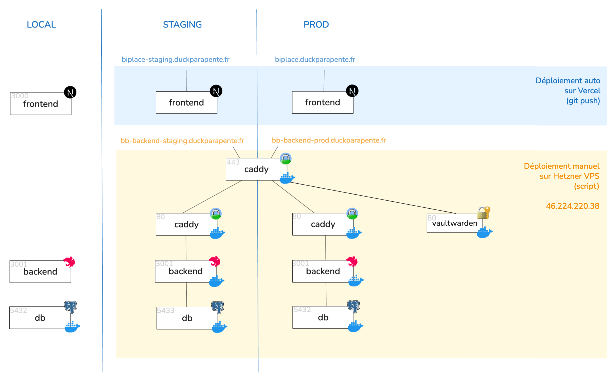

# Biplace Booking Infrastructure

## Architecture



## Pré-requis

Pour lancer le projet, il te faut:

- `docker` avec le plugin compose (docker-compose est déprécié)
- `node` >=20.10.0 (cf. package.json)

## Comment déployer en staging/prod?

Pour déployer un environnement, tu peux lancer `pnpm deploy:(staging|prod)` depuis ton local. Cette commande va principalement:
- Build une image Docker avec le backend
- L'uploader au bon endroit sur le serveur
- La dézipper
- Relancer les conteneurs qui sont up (caddy+db+backend)

## Crons spécifiques au projet

### Attribution automatique des packs

Tous les jours, toutes les 30mn, l'attribution automatique des packs est exécutée via `pnpm attribute`. Avant 20h, l'algo n'attribue des packs que pour J+0 à J+5. Après 20h, il regarde de J+1 à J+6.

Voici la config du cron:

```
    0,30 * * * * docker exec bb-staging-backend sh -c "cd apps/backend && pnpm attribute" >> /var/log/attribute.log 2>&1
    0,30 * * * * docker exec bb-prod-backend sh -c "cd apps/backend && pnpm attribute" >> /var/log/attribute.log 2>&1
```

**Comportement**:
- Avant 20h: attribue des packs pour J+0 à J+5
- Après 20h: attribue des packs pour J+1 à J+6


---

**Pour plus de détails sur l'infrastructure serveur, l'accès SSH, les backups et les autres crons, voir la [documentation infrastructure du serveur](https://github.com/Duck-Parapente/server-entrypoint/blob/main/docs/infrastructure.md).**

