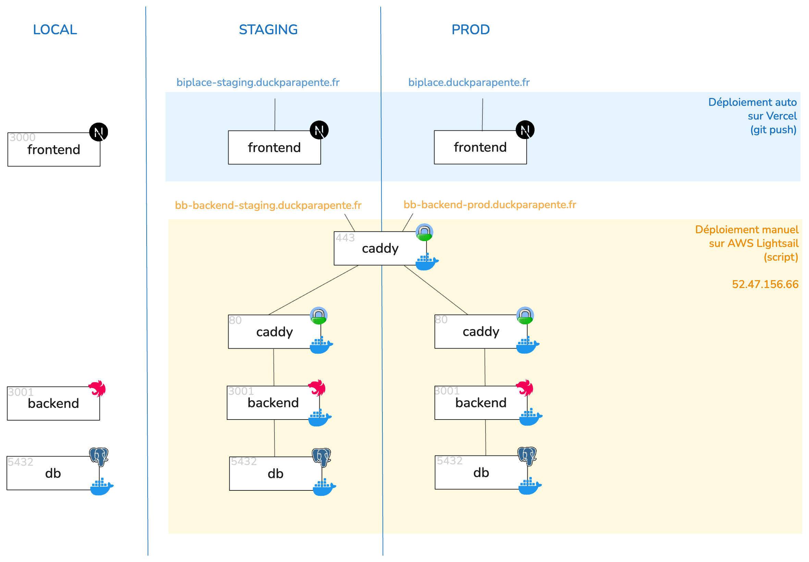

# Biplace Booking Infrastructure

### Architecture


### Pré-requis

Pour lancer le projet, il te faut:
- docker avec le plugin compose (docker-compose est déprécié)
- pour le serveur AWS, il faut en plus créer un réseau proxy `docker network create proxy` (valable uniquement pour une installation from scratch)

### Comment développer en local?

Rien de plus simple:
- Installer les dépendances avec `pnpm install`
- Lance `pnpm dc:local` pour démarrer un conteneur avec une DB.
- Lancer `pnpm dev` pour lancer le front et le back.
- Pour lancer uniquement le backend `pnpm dev:backend` (idem pour le front)

### Comment déployer en staging/prod?

- Il faut déjà avoir accès au serveur du Duck en récupérant la clé PEM. Ensuite, il suffit de modifier ta `~/.ssh/config`:
    ```
    Host duck-tower
    Hostname 52.47.156.66
    User ec2-user
    PreferredAuthentications publickey
    IdentityFile ~/.ssh/aws-duck-tower.pem
    ```
- Chaque environnement a son dossier spécifique:
    - staging: `/srv/biplace-booking-staging`
    - prod: `/srv/biplace-booking-prod`
- Pour déployer un environnement, tu peux lancer `pnpm deploy:(staging|prod)` depuis ton local. Cette commande va principalement:
    - Build une image Docker avec le backend
    - L'uploader au bon endroit sur le serveur
    - La dézipper
    - Relancer les conteneurs qui sont up (caddy+db+backend)


